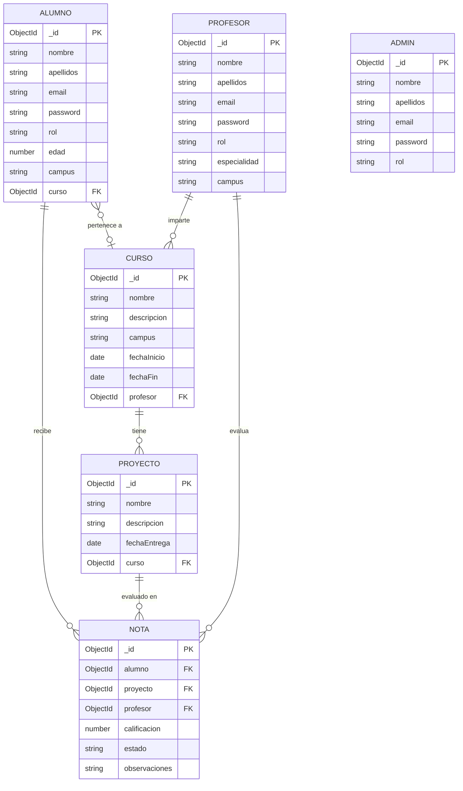

# Diagrama Entidad-Relación — AprenTIC Campus API

```mermaid
erDiagram
    ALUMNO {
        ObjectId _id PK
        string nombre
        string apellidos
        string email
        string password
        string rol
        number edad
        string campus
        ObjectId curso FK
    }

    PROFESOR {
        ObjectId _id PK
        string nombre
        string apellidos
        string email
        string password
        string rol
        string especialidad
        string campus
    }

    ADMIN {
        ObjectId _id PK
        string nombre
        string apellidos
        string email
        string password
        string rol
    }

    CURSO {
        ObjectId _id PK
        string nombre
        string descripcion
        string campus
        date fechaInicio
        date fechaFin
        ObjectId profesor FK
    }

    PROYECTO {
        ObjectId _id PK
        string nombre
        string descripcion
        date fechaEntrega
        ObjectId curso FK
    }

    NOTA {
        ObjectId _id PK
        ObjectId alumno FK
        ObjectId proyecto FK
        ObjectId profesor FK
        number calificacion
        string estado
        string observaciones
    }

    ALUMNO  }o--o| CURSO    : "pertenece a"
    PROFESOR ||--o{ CURSO   : "imparte"
    CURSO    ||--o{ PROYECTO : "tiene"
    ALUMNO   ||--o{ NOTA    : "recibe"
    PROYECTO ||--o{ NOTA    : "evaluado en"
    PROFESOR ||--o{ NOTA    : "evalua"
```
